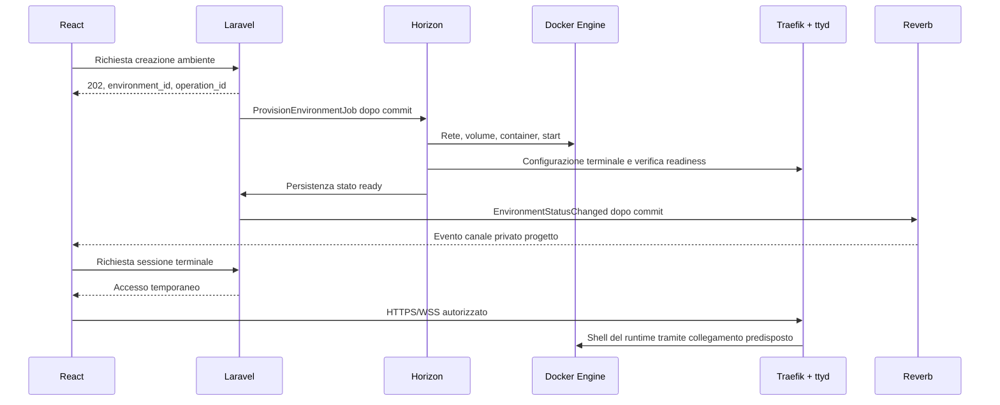

# Feature: ambienti di progetto

Stato: **proposta da implementare**. Per entità, campi e relazioni vedere [il modello](../models/environment.md); per completamento e parsing vedere [execution](execution.md). Lo [stato effettivo del repository](../README.md) distingue componenti configurati e funzionalità future.

## Obiettivo e responsabilità

Un progetto può avere zero o più ambienti. Il massimo è configurabile dall'amministratore della piattaforma; il proprietario crea e gestisce gli ambienti entro quel limite. Creare il progetto non richiede il provisioning: l'attuale `POST /api/v1/projects` continua a creare soltanto il progetto. Un eventuale wizard «crea progetto e ambiente» deve coordinare due operazioni distinte.

L'ambiente mantiene la propria identità quando il container viene ricreato. Configurazione, workspace e storico appartengono all'ambiente; container ID, IP e cgroup appartengono alla sua generazione runtime.

| Componente | Responsabilità proposta |
| --- | --- |
| Laravel API | Autorizzazione, quote, stato desiderato, emissione delle sessioni terminale |
| Job Horizon | Provisioning e ciclo di vita tramite Docker Engine API |
| Docker Engine | Reti, volumi, container e processi avviati con exec |
| ttyd e tmux | Collegamento terminale e sessione shell persistente alle disconnessioni |
| Traefik | Routing HTTPS/WSS e verifica di accesso al terminale |
| Collector host | Osservazione processi e file; invio di segnali grezzi |
| Consumer Laravel | Correlazione, deduplicazione, inventario tool ed eventi di dominio |
| Reverb/Echo | Aggiornamenti di stato alla UI; nessun trasporto dell'I/O della shell |

## Provisioning asincrono

Flusso proposto per `POST /api/v1/projects/{project}/environments`:

1. Autenticare l'utente e verificare proprietà, stato del progetto, immagine approvata, configurazione e quote. Prenotare lo slot in modo atomico, includendo gli ambienti già in provisioning.
2. Salvare ambiente e operazione con `operation_id` in transazione, stato `provisioning`; accodare `ProvisionEnvironmentJob` dopo il commit. Per coprire anche un crash tra commit e dispatch prevedere outbox o recupero delle operazioni non accodate.
3. Rispondere `202 Accepted` con ID e stato dell'operazione. Il frontend usa polling e, quando disponibile, eventi.
4. Il job rilegge autorizzazioni e stato desiderato, acquisisce un lock per ambiente, seleziona il nodo e crea o recupera rete, volume e container.
5. Avviare il processo principale e predisporre tmux e ttyd. Verificare workspace, container e terminale separatamente.
6. Salvare lo stato `ready`, poi pubblicare `EnvironmentStatusChanged` dopo il commit. L'evento aggiorna la UI, non è una seconda risposta alla richiesta iniziale.

Avvio, arresto, ricreazione e cancellazione seguono lo stesso contratto di operazione asincrona. Il worker non mantiene aperta una richiesta HTTP per tutta la durata dello spawn.

## Docker Engine API: collegamento e chiamate

Il provisioner usa HTTP verso Docker Engine. Su un nodo Linux locale il trasporto è il socket Unix `/var/run/docker.sock`; per un nodo remoto serve un canale autenticato, per esempio TLS mutuale, oppure un agente di orchestrazione. Non pubblicare il daemon senza autenticazione. Un client PHP compatibile, anche della famiglia docker-php, oppure Guzzle con trasporto cURL e `CURLOPT_UNIX_SOCKET_PATH` sono alternative da valutare; nessuna libreria PHP Docker è stata selezionata o aggiunta. Negoziare una versione API supportata dal daemon. [Docker SDK e accesso HTTP](https://docs.docker.com/reference/api/engine/sdk/).

Contratto minimo del nostro adapter, con percorsi relativi al prefisso API negoziato:

| Operazione | Chiamata Engine |
| --- | --- |
| Verifica compatibilità | `GET /version` |
| Creazione rete | `POST /networks/create` |
| Creazione volume | `POST /volumes/create` |
| Creazione container | `POST /containers/create?name=...` |
| Avvio e ispezione | `POST /containers/{id}/start`, `GET /containers/{id}/json` |
| Avvio comando nel container | `POST /containers/{id}/exec`, poi `POST /exec/{id}/start` |
| Esito comando gestito | `GET /exec/{id}/json` |
| Arresto e rimozione | `POST /containers/{id}/stop`, `DELETE /containers/{id}` |
| Cleanup esplicito | `DELETE /networks/{id}`, `DELETE /volumes/{name}` |

Il payload container comprende `Image`, `Cmd`, `Labels` e `HostConfig`: rete, mount del volume, `Memory` in byte, `NanoCpus`, `PidsLimit` e capability autorizzate. L'exec interattivo richiede gestione dello stream, TTY, input e resize; una richiesta JSON ordinaria non basta. Questi percorsi e campi sono documentati nella [reference Engine API](https://docs.docker.com/reference/api/engine/version/v1.46/); la versione citata è una reference, non un vincolo del deployment.

Nomi e label devono includere ambiente e generazione, oltre al progetto: `project-42-env-7-...` evita collisioni tra due ambienti dello stesso progetto. L'adapter riceve configurazione validata, non un payload Docker arbitrario dal browser. Conservare gli ID restituiti e verificare le label di proprietà prima di riutilizzare risorse.

Un timeout HTTP non prova che Docker non abbia creato la risorsa. Prima del retry cercarla e ispezionarla; distinguere conflitti, risorsa assente, daemon irraggiungibile e immagine non disponibile. Prevedere timeout distinti per collegamento, pull, avvio e readiness. Non usare `docker run` costruito come stringa shell nel controller.

## Rete, volume e processo principale

La proposta `Internal: true` crea una rete senza connettività esterna ordinaria, ma non risolve da sola lo scope del progetto. Apt e scansioni verso target esterni richiedono un percorso di uscita controllato. Una seconda rete con uscita può aggirare l'isolamento previsto: la topologia deve esplicitare gateway, DNS e regole egress. [Reti Docker](https://docs.docker.com/engine/network/).

Per questa bozza si propone una rete di lavoro per ambiente, con eventuale comunicazione tra ambienti abilitata esplicitamente. Il canale di ingresso del terminale deve consentire soltanto i collegamenti necessari; una rete proxy condivisa non deve consentire traffico laterale tra ambienti. IP/DNS runtime e target autorizzati restano dati distinti.

Usare un volume nominato per ambiente, montato in `/workspace`; gli output gestiti vanno in `/workspace/executions/{execution_id}`. Il precedente esempio `/data` o `/scans` va ricondotto a questo percorso unico. Lo storage persistente deve avere quota e retention: la sola dichiarazione di un limite nel database non lo applica al volume.

`Cmd: ['tmux', 'new-session', '-d', '-s', 'main']` da solo non è sufficiente: il comando termina dopo avere avviato tmux in background. Serve un processo principale in foreground, con gestione dei segnali e dei figli, che mantenga il runtime attivo; l'entrypoint prepara tmux e avvia il servizio previsto. Il ciclo di vita del container dipende dal suo processo principale. [Esecuzione dei container](https://docs.docker.com/engine/containers/run/).

Il volume conserva i file, non automaticamente i pacchetti installati nella root del container. Stop/start dello stesso container e ricreazione sono operazioni diverse. La ricreazione richiederà reinstallazione dichiarativa o una strategia di snapshot/immagine ancora da scegliere; tmux non sopravvive alla perdita del container. Non dichiarare persistenti tutte le installazioni perché esiste un volume.

## Terminale: collocazione e accesso

La collocazione di ttyd resta da validare con un prototipo. Due opzioni coerenti:

| Opzione | Collegamento e conseguenze |
| --- | --- |
| ttyd nell'ambiente | Avvia `tmux attach -t main` localmente; non richiede accesso Docker. Il servizio è però nello stesso confine modificabile dalla shell del proprietario |
| ttyd in un gateway fidato | Usa un bridge di exec autorizzato verso il runtime. Gestione centralizzata di accessi e revoche; il gateway resta un componente privilegiato |

Il comando della conversazione `ttyd --writable -p 0 docker exec -it <container_id> tmux attach -t main` descrive la seconda opzione: richiede CLI Docker e accesso al daemon nel gateway. Non va copiato in un sidecar esposto all'utente con il socket Docker montato. Un bridge via Engine API può sostituire la CLI, ma va implementato e verificato.

ttyd supporta porta casuale con `-p 0`, scrittura con `--writable`, controllo origine e limiti client. Per il routing si propone una porta interna deterministica, per esempio 7681; con porta casuale l'orchestratore deve scoprirla e aggiornare il routing. [Opzioni ttyd](https://github.com/tsl0922/ttyd).

Traefik deve puntare al servizio che ospita davvero ttyd, non automaticamente al container di lavoro. Configurare router, service, porta interna e rete raggiungibile; una sola label `Host(...)` non definisce l'intero collegamento. Se ttyd gira sull'host, serve configurazione dinamica del relativo backend. I nomi host o i percorsi devono includere l'ambiente. DNS e certificati TLS fanno parte del provisioning del gateway. [Routing e porte Traefik](https://docs.docker.com/guides/traefik/).

Proposta di accesso:

1. Laravel verifica utente, progetto, ambiente pronto e permesso di shell; emette una sessione breve legata a questi identificatori.
2. Traefik interroga un endpoint di autorizzazione durante l'handshake; la verifica deve riconoscere esattamente il backend richiesto e fallire in caso di errore. [ForwardAuth](https://doc.traefik.io/traefik/reference/routing-configuration/http/middlewares/forwardauth/).
3. Il browser apre il terminale con il client ttyd incorporato oppure con un adapter React/xterm.js che ne implementi il protocollo. Il solo URL WSS non rende compatibile un client xterm.js generico.
4. Un gestore delle sessioni deve chiudere connessioni già aperte a revoca, scadenza o stop ambiente. La verifica HTTP iniziale non rivaluta ogni frame WebSocket.

Non consentire argomenti di comando arbitrari nella URL. Se si usa un header di identità, deve essere sovrascritto dal proxy fidato e non accettato da connessioni dirette. Il controllo origine deve essere compatibile con il dominio del frontend: progettare stesso origin tramite proxy, client incorporato o una validazione esplicita. Non disabilitarlo indiscriminatamente per risolvere un errore cross-origin.

## Due canali verso React

L'ultima freccia rappresenta l'accesso al runtime: con ttyd interno il collegamento è locale a tmux; con gateway passa dal bridge exec.

L'I/O della shell percorre React → Traefik → ttyd → tmux. Laravel rilascia l'accesso ma non vede direttamente ciò che l'utente digita e non interpreta questo stream. Un'eventuale registrazione terminale richiede un recorder dedicato con retention e trattamento dei dati sensibili; non è fornita automaticamente da Reverb o da eBPF.

Gli eventi `EnvironmentStatusChanged`, `ToolInstalled` e `ScanCompleted` viaggiano su Reverb e un canale privato proposto `project.{projectId}`. Laravel deve autorizzare la membership corrente e includere `environment_id`, `event_id` e versione dello stato nei payload. Echo ascolterà i nomi coerenti con la convenzione di broadcasting scelta. Una revoca deve rimuovere anche l'accesso alle sottoscrizioni già aperte. Alla riconnessione React rilegge lo stato dalle API: il broadcast non è lo storico autorevole.

## Catalogo tool e rilevamento installazioni

Un agente eBPF gira sul nodo Linux che esegue i container, con privilegi limitati al necessario. Osserva i processi del cgroup associato al runtime; non gira dentro Laravel. Con Docker Desktop il nodo è la VM Linux, non il sistema Windows che ospita l'editor.

`execve` e `execveat` possono segnalare l'avvio di apt/apt-get, pip, go, cargo o gem. L'osservazione non garantisce che l'exec sia riuscita né che l'installazione termini bene. L'agente deve distinguere tentativo, avvio effettivo ed esito del processo; il consumer applica regole specifiche del package manager.

Flusso proposto:

1. Il collector emette un evento grezzo con nodo, container, cgroup, identità processo e argomenti filtrati.
2. Un trasporto asincrono consegna l'evento al consumer, come descritto in [execution](execution.md#trasporto-degli-eventi-grezzi).
3. Il consumer correla avvio e terminazione; un comando `apt install nikto` crea prima un tentativo di installazione.
4. `RecordToolInstallJob` verifica l'inventario nel contesto corretto: pacchetti installati, versione e percorso. L'esecuzione di eventuali verifiche avviene nel runtime isolato, non sull'host Laravel.
5. Solo dopo la verifica salva l'installazione corrente e pubblica `ToolInstalled`; errori e tentativi restano audit distinti.

Un comando può installare più pacchetti e dipendenze, usare un virtualenv o non cambiare nulla. Prevedere inventario iniziale dell'immagine e riconciliazione per aggiornamenti, rimozioni, binari copiati manualmente ed eventi persi. Il catalogo deve indicare ambiente, versione, contesto e data verifica, senza promettere rilevamento completo da un filtro sul nome del processo.

L'agente non decide proprietario, permessi o modello `ProjectTool`: invia fatti del runtime e il backend li riconduce al dominio. Non registrare indiscriminatamente argomenti o environment contenenti credenziali.

## Isolamento, permessi e ciclo di vita

Il proprietario gestisce configurazione, rete, installazioni e shell. I collaboratori operano soltanto tramite profili e permessi espliciti descritti nella feature execution. Un ruolo admin globale non implica accesso automatico ai progetti altrui.

Vincoli proposti per l'implementazione:

- Separare i nodi runtime da Laravel, database e Redis; per shell non fidate valutare VM/microVM secondo il livello di isolamento richiesto.
- Non montare il socket Docker negli ambienti. Tenere l'accesso al daemon nell'orchestratore/gateway fidato; limitarne separatamente l'accesso di discovery usato da Traefik.
- Usare `exposedByDefault=false`, immagini approvate con digest e regole di rete che blocchino servizi interni, metadati cloud e traffico tra progetti.
- Evitare `privileged` e rete host. Non concedere `NET_ADMIN` e `NET_RAW` a tutti gli ambienti per default: concederle solo a profili che ne dimostrino la necessità.
- Applicare limiti CPU, memoria, processi e storage nel runtime effettivo. La configurazione ha schema chiuso e riferimenti ai segreti, mai credenziali in chiaro.
- Conservare audit di provisioning, accessi terminale, esecuzioni gestite e modifiche di configurazione.

Lo stato applicativo segue il modello: `inactive`, `provisioning`, `stopped`, `starting`, `ready`, `stopping`, `error`, `deleting`. `running` è un'osservazione Docker; non implica terminale pronto. Lo stop deve revocare le sessioni, coordinare le execution e conservare il volume. Il purge richiede invece una policy esplicita di eliminazione dei dati e cleanup verificato di container, rete e volume.

Un reconciler periodico confronta database e Docker: risorse mancanti, orfane, generazioni obsolete e operazioni bloccate. Non cancella risorse soltanto perché il nome somiglia a quello atteso: verifica label e ownership. I retry usano lock, idempotenza e backoff; un fallimento parziale conserva diagnosi e risorse persistenti necessarie al recupero.

## Prerequisiti prima dell'implementazione

Confermare client Docker e nodo Linux, topologia egress, collocazione ttyd, protocollo/sessioni terminale e persistenza delle installazioni. Configurare le future code `provisioning`, `telemetry` e `parsing` nei supervisor Horizon: oggi è ascoltata solo `default`. Allineare timeout dei job e `retry_after`, senza tenere occupato un job per tutta la durata di una shell interattiva.

Reverb, canali privati, autorizzazioni di sottoscrizione, collector e consumer restano da implementare. Le verifiche di accettazione dovranno coprire retry senza duplicati, accesso tra progetti, revoche su socket aperti, blocco egress e ricreazione con conservazione del workspace.

