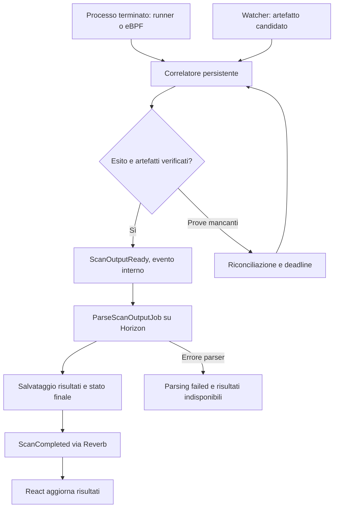

# Feature: execution, rilevamento e risultati

Stato: **proposta da implementare**. Il [modello](../models/environment.md) descrive i dati da conservare; la [feature ambiente](environment.md) descrive runtime, terminale e catalogo tool.

## Il confine che manca nella shell libera

Laravel non è nel percorso del traffico terminale. Non conosce automaticamente il comando digitato, il processo avviato o il file di output. Docker conosce il container, ma non il concetto applicativo di «scan completato per questo progetto».

Distinguere due modalità:

| Modalità | Correlazione disponibile |
| --- | --- |
| Esecuzione gestita | Laravel assegna `execution_id`, profilo, target, runtime e directory output prima dell'avvio; un runner registra processo ed esito |
| Esecuzione osservata da shell libera | Collector e watcher producono segnali da correlare; occorre registrazione esplicita o una convenzione verificabile per attribuirli a una execution |

Per la shell libera si propone un wrapper facoltativo o una registrazione preventiva che riservi un ID e una directory. Senza questo contratto, due `nmap` nello stesso container, pipeline, subprocessi o file riutilizzati rendono ambigua l'associazione. Il cgroup del container identifica l'ambiente, non ogni scan. Gli eventi senza correlazione certa restano osservazioni da riconciliare: non inventare un autore o un completamento.

L'osservazione eBPF non equivale a una policy preventiva. I limiti applicativi delle execution gestite non vincolano automaticamente i comandi liberi; per questi restano necessari confini di rete e risorse applicati dal runtime.

## Avvio delle execution gestite

Il proprietario gestisce ambienti, installazioni, scope e profili. La shell libera resta proposta per il solo proprietario. I contributor possono avviare profili approvati con `scans.execute`, che richiede `scans.read`; possono annullare soltanto le proprie execution. Non possono avviare implicitamente un ambiente fermo. Viewer e contributor senza quei permessi non acquisiscono capacità operative dal solo ruolo.

Solo progetti attivi e ambienti pronti possono iniziare esecuzioni. Autorizzazioni, scope e disponibilità degli slot devono essere ricontrollati dal worker prima dell'avvio. Quote atomiche per progetto/utente impediscono che richieste simultanee superino il limite; vale il limite più restrittivo tra piattaforma, progetto e profilo.

La richiesta valida salva uno snapshot della configurazione e dei target, crea `execution_id` e accoda il job dopo il commit. Il runner avvia argomenti strutturati nell'ambiente autorizzato e registra identità del processo o dell'exec Docker. Il job di avvio non attende indefinitamente l'intera scansione: esito e timeout sono gestiti dal monitor.

Per comandi lanciati tramite Docker exec, l'ispezione dell'exec può fornire stato ed exit code. Per quelli digitati nella shell non esiste automaticamente un exec Docker distinto per ogni comando: qui servono il runner o l'osservazione host. [Contratto Engine API](https://docs.docker.com/reference/api/engine/version/v1.46/).

## File watcher: output presente non significa scan riuscito

Ogni execution usa `/workspace/executions/{execution_id}/`. Un manifest del profilo dichiara file attesi, formato, obbligatorietà e limiti di dimensione. Esempi: `output.xml` per un parser XML, `output.json` per uno JSON. Un tool privo di integrazione può lasciare artefatti grezzi, ma non ottiene automaticamente parsing strutturato.

Il watcher osserva `IN_CLOSE_WRITE` e `IN_MOVED_TO` per file scritti direttamente o rinominati da un temporaneo. La chiusura di un descrittore aperto in scrittura non significa che nessun altro writer sia attivo, che il file non venga riaperto o che il processo abbia terminato con successo. Inotify può perdere eventi per overflow e non offre una sorveglianza ricorsiva automatica: servono watch delle directory interessate e riconciliazione. [Semantica e limiti inotify](https://man7.org/linux/man-pages/man7/inotify.7.html).

Il watcher deve avere accesso reale al workspace sul nodo runtime. Un percorso dentro il container non è automaticamente leggibile da un worker Laravel su un altro nodo. Il collector può accedere al volume tramite mount autorizzato e trasferire l'artefatto a storage controllato; l'evento per Laravel contiene una storage key oppure un riferimento che l'adapter sappia risolvere.

Contratto di acquisizione proposto:

1. Associare file e directory a execution e generazione runtime.
2. Attendere la conclusione dei writer gestiti e un intervallo di stabilità; rilevare tutti i file obbligatori.
3. Acquisire una copia immutabile nello storage degli artefatti, con dimensione e checksum.
4. Validare formato e contenuto previsto e registrare l'esito.

La stabilità è un'euristica per output non gestiti; non costituisce prova assoluta di completamento. Il contratto più affidabile usa un runner che finalizza gli artefatti prima di pubblicarne il manifest definitivo. Per shell libera e segnali incompleti conservare la qualità dell'evidenza.

Non fidarsi del `file_path` ricevuto: rifiutare traversal e symlink verso percorsi esterni, applicare limiti, disabilitare entità esterne e accessi di rete nei parser XML. Il parser legge la copia acquisita, evitando che il file cambi tra controllo e parsing.

## Processo terminato: eBPF e runner

L'agente eBPF opera sull'host Linux del runtime. L'avvio può essere osservato tramite eventi di exec; la conclusione richiede un segnale di uscita. La syscall `exit_group` termina il gruppo di thread, ma osservarne soltanto l'invocazione non copre tutti gli esiti, in particolare morti causate da segnali. [Semantica exit_group](https://man7.org/linux/man-pages/man2/exit_group.2.html).

Un hook come `sched_process_exit` è una base per il collector, non un evento di dominio già pronto. Occorre distinguere thread, processo leader e albero dell'execution; decodificare correttamente esito e segnale, anche quando il processo è terminato per forza. Un esempio concreto è [BCC exitsnoop](https://github.com/iovisor/bcc/blob/master/tools/exitsnoop.py), da adattare al kernel e alla correlazione del runtime.

L'implementazione deve provare almeno: esito zero, esito non zero, SIGTERM, SIGKILL, processo multithread, figli ancora attivi, PID riutilizzato, riavvio nodo, collector disconnesso e perdita di eventi. Un evento di uscita di un singolo thread non deve completare l'execution. Il processo padre può terminare lasciando figli che scrivono; per avvii gestiti il runner può seguire il gruppo o un cgroup dedicato.

Identità proposta: nodo, boot ID, container ID/generazione, cgroup, PID/TGID e tempo di avvio del processo. L'`execution_id` si aggiunge solo quando la correlazione è stata registrata. Il nome del tool serve al riconoscimento, non come chiave univoca.

Exit code sconosciuto, OOM sospetto o collector offline restano evidenze distinte. Non inferire «successo» dall'assenza di un errore; non attribuire automaticamente ogni SIGKILL all'OOM killer.

## Combinare le prove e assegnare gli stati

File e processo possono produrre eventi in qualsiasi ordine. Il correlatore conserva entrambi e rivaluta la execution a ogni arrivo, con deadline per processo e finalizzazione artefatti. Non presupporre la sequenza rigida «exit, poi close»: spesso il file viene chiuso prima dell'uscita.

| Segnali disponibili | Interpretazione proposta |
| --- | --- |
| Processo attivo, file chiuso | Artefatto candidato; execution ancora in corso |
| Processo riuscito, file obbligatorio mancante | Attesa limitata di finalizzazione; poi errore output |
| Processo riuscito, artefatti validi e acquisiti | Avvio parsing; risultati non ancora necessariamente disponibili |
| Processo fallito, artefatti parziali utilizzabili | `completed_with_errors` solo se il profilo ammette risultati parziali |
| Artefatti validi, esito processo ignoto | Evidenza incompleta; riconciliazione o stato esplicito di esito sconosciuto |
| Annullamento o timeout | Richiesta stop, verifica della terminazione e conservazione delle prove parziali |

Gli eventi normalizzati restano indipendenti dal tool: `execution.started`, `execution.artifact_detected`, `execution.completed`, `execution.completed_with_errors`, `execution.failed`, `execution.timed_out`, `execution.cancelled`. Per incompletezza delle prove si propone anche `execution.outcome_unknown`; gli stati intermedi comprendono attesa artefatti e parsing.

Il significato di `ScanCompleted` va fissato senza confondere processo terminato e risultati pronti. Proposta per il flusso:



`ScanOutputReady` è il nome interno proposto per il segnale che nella conversazione veniva chiamato `ScanCompleted` prima del parsing. `ScanCompleted` verso React significa qui che il risultato finale è persistito, con esito completo o parziale esplicito. Questo evita che la UI annunci risultati pronti mentre il job deve ancora leggerli. Tool e formato selezionano il parser; non servono lifecycle diversi per nmap, ffuf e ogni nuovo tool.

Un tool che non produce artefatti può completare soltanto se il profilo prevede esplicitamente tale comportamento. Exit code zero non certifica validità dei risultati né rispetto dello scope.

## Trasporto degli eventi grezzi

Il programma eBPF raccoglie segnali kernel; un collector in user space li serializza e li invia. È questo processo a parlare con Redis o con un endpoint interno. Non assegnare al programma eBPF il compito di pubblicare direttamente messaggi Laravel.

Proposta primaria: Redis Stream dedicato alla telemetria, separato logicamente e tramite ACL dalle code Horizon. Il consumer usa un consumer group, riconosce gli eventi elaborati e recupera quelli rimasti pendenti dopo un crash. Redis espone `XREADGROUP`, `XACK` e `XAUTOCLAIM` per questi meccanismi. La consegna può ripetersi; serve deduplicazione applicativa. [Redis Streams](https://redis.io/docs/latest/develop/data-types/streams//).

Horizon esegue job Laravel sulle code Redis; non consuma automaticamente messaggi di un Redis Stream. Serve un processo consumer dedicato che valida/persistisce l'evento e accoda `RecordToolInstallJob`, correlazione o parsing nel formato Laravel.

Alternativa: webhook interno autenticato con risposta rapida dopo persistenza. Il collector user space gestisce autenticazione, retry e spool; non è una chiamata sincrona fatta dal programma eBPF e non deve bloccare l'osservazione del kernel. Redis Stream e webhook sono alternative progettuali, non due trasporti già implementati.

Envelope illustrativo di evento grezzo, ancora da versionare formalmente:

```json
{
  "schema_version": 1,
  "event_id": "evt-example-001",
  "event_type": "process.exited",
  "occurred_at": "2026-09-09T12:00:00Z",
  "agent_id": "runtime-agent-1",
  "node_id": "runtime-node-1",
  "boot_id": "boot-example",
  "container_id": "container-example",
  "runtime_generation": 2,
  "cgroup_id": "123456",
  "process": {
    "pid": 2401,
    "tgid": 2401,
    "start_time_ns": "123456789000",
    "executable": "/usr/bin/nmap"
  },
  "correlation_id": "exec-example",
  "exit_code": 0,
  "signal": null
}
```

ID e tempi ad alta precisione restano stringhe dove necessario per evitare perdita di precisione nei client. `correlation_id` è nullable per processi non registrati. L'evento file è separato e contiene il percorso relativo e l'identità dell'artefatto; il percorso locale da solo non è un'autorizzazione a leggerlo.

Il consumer risolve progetto e ambiente da un mapping runtime fidato, verificando generazione e agente. Non accetta `project_id` o `user_id` dichiarati da un container come fonte di autorizzazione. Aggiunge data di ricezione e conserva l'originale validato con retention definita.

Contratto di affidabilità proposto:

- `event_id` univoco e transazione di ingestione; gli eventi duplicati non duplicano righe, parsing o notifiche.
- ACK dopo persistenza durabile. Un'outbox o un dispatcher recuperabile copre il passaggio database → coda Laravel: un crash dopo ACK non deve perdere il job.
- Recupero dei pending, retry con backoff e deposito degli eventi non elaborabili per diagnosi; retention dello stream coerente con il tempo massimo di recupero.
- Spool locale limitato, metriche di lag, overflow e perdita eventi. In caso di lacune, riconciliare inventario, runtime e file invece di dichiarare completamento certo.
- Autenticazione del nodo e autorizzazioni minime sul trasporto; nessuna credenziale Redis disponibile alla shell dell'ambiente.

Il formato resta generico anche per le installazioni: il consumer interpreta package manager ed evidenze e aggiorna il [catalogo tool](environment.md#catalogo-tool-e-rilevamento-installazioni). Agente e trasporto non conoscono policy Laravel o destinatari Reverb.

## Parsing, aggiornamenti e recupero

`ParseScanOutputJob` usa artefatti acquisiti, parser selezionato dal profilo e limiti di CPU/memoria/tempo. Registra versione parser ed errore; un formato non supportato resta disponibile come artefatto grezzo senza inventare risultati.

Proposta di idempotenza del parsing: execution, checksum dell'artefatto e versione parser. Un retry non duplica findings o risultati. Il nuovo tentativo può correggere un errore di parsing senza modificare l'esito storico del processo.

Risultati, stato ed evento da pubblicare devono avere un passaggio durabile, poi broadcast sul canale privato autorizzato. React riceve ID, stato e versione, recupera i dati autorizzati dalle API e ignora eventi obsoleti o duplicati. Non trasmettere percorsi host o output grezzo indiscriminatamente a tutti i membri.

Il passaggio del progetto a inattivo/archiviato impedisce nuovi avvii, annulla le execution in coda e richiede lo stop di quelle attive. Revoche di accesso vanno ricontrollate prima dell'avvio; per attività già avviate interessate dalla revoca viene richiesto lo stop. Lo stato del progetto non prova che il processo sia già fermo.

Timeout e annullamento coordinano stop del gruppo gestito, verifica di uscita e rilascio atomico degli slot. Una risposta Docker incerta richiede riconciliazione; un errore di connessione non va trasformato in «processo arrestato». Conservare output parziale e motivo terminale anche se il parser fallisce.

## Verifiche richieste prima di considerare pronta la feature

Provare eventi file/exit invertiti e duplicati, rename atomico, file riaperto o parziale, writer figli ancora attivi, zero senza output, errore con output valido, parser fallito, collector offline e restart del consumer dopo persistenza ma prima del dispatch.

Provare inoltre correlazione di due scan contemporanei nello stesso container, artefatti di una vecchia generazione runtime, traversal/symlink, revoca dei permessi e recupero della UI dopo disconnessione. Sono criteri per la futura implementazione, non test già presenti nel repository.

