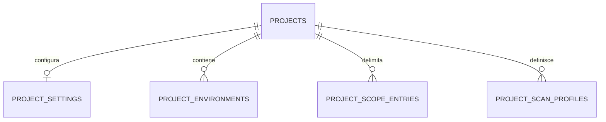

# Ambienti, scope e profili di scansione

Questo documento descrive dati, relazioni e vincoli proposti. I flussi operativi sono in [feature/environment.md](../feature/environment.md) e [feature/execution.md](../feature/execution.md).

Stato: **bozza futura da revisionare**, esclusa dalla prima implementazione del progetto. Le proposte qui raccolte non sono decisioni approvate né richiedono migration in questa fase.

Il modello principale è descritto in [project.md](project.md). Un progetto deve poter essere creato e gestito senza ambienti, profili o configurazioni di scansione.

## Relazioni proposte per la fase successiva

## Settings generali — `project_settings`

Relazione uno a uno opzionale, introdotta quando verrà attivato il modulo scansioni. `project_id` è sia PK sia FK, evitando righe duplicate. La prima creazione del progetto non richiede questa tabella; in futuro l'esecuzione richiederà impostazioni valide.

| Campo | Significato |
| --- | --- |
| `project_id` | FK verso il progetto |
| `max_concurrent_scans` | Limite positivo complessivo per progetto; default proposto 1 |
| `max_concurrent_scans_per_user` | Limite positivo per utente; default proposto 1 |
| `scan_timeout_seconds` | Durata massima consentita per singola esecuzione |
| `created_at`, `updated_at` | Date |

I limiti sono configurabili dal proprietario entro massimali della piattaforma. Il proprietario ha piena gestione funzionale, ma non può disattivare i vincoli infrastrutturali. Per l'MVP, «quanto possono eseguire» significa permessi e limiti condivisi per utente; quote diverse per ciascun collaboratore sono una possibile estensione da confermare.

## Ambienti — `project_environments`

Relazione progetto uno a molti: un progetto può avere zero o più ambienti, evitando una futura conversione da uno a uno.

| Campo | Significato |
| --- | --- |
| `id`, `project_id` | Identificatore e FK obbligatoria |
| `name` | Nome univoco all'interno del progetto |
| `description` | Testo facoltativo |
| `base_image` | Riferimento immagine, idealmente con digest per riproducibilità |
| `desired_state` | Obiettivo richiesto: `stopped`, `running` oppure `deleted` |
| `status` | Stato applicativo osservato: `inactive`, `provisioning`, `stopped`, `starting`, `ready`, `stopping`, `error`, `deleting` |
| `runtime_reference` | Riferimento interno al runtime, nullable prima del provisioning; non scrivibile dal client |
| `runtime_generation` | Generazione del container; distingue eventi e installazioni precedenti a una ricreazione |
| `runtime_status` | Stato Docker osservato, separato dalla readiness applicativa |
| `workspace_reference` | Riferimento interno al volume persistente, indipendente dall'identità del container |
| `last_error`, `last_observed_at` | Ultimo errore operativo e data dell'ultima riconciliazione |
| `network_configuration` | JSON validato: modalità IP automatica/statica, eventuale IP privato richiesto, resolver DNS, domini di ricerca |
| `resource_limits` | JSON validato: CPU, memoria e storage entro limiti infrastrutturali |
| `created_at`, `updated_at` | Date |

IP effettivo, identificativi container e percorsi dei volumi sono dati operativi assegnati dall'orchestratore, non valori arbitrari scelti via API. Un IP statico richiesto deve appartenere alla rete isolata assegnata all'ambiente. Il DNS dell'ambiente configura la risoluzione dei nomi: non concede l'autorizzazione a scansionare quei nomi.

I JSON sono ammessi qui per piccoli oggetti di configurazione con schema chiuso e versionabile, non per membership, permessi o relazioni. Non contengono password, token o chiavi private. Il futuro modulo secrets conserverà i segreti separatamente e le configurazioni useranno riferimenti autorizzati.

## Target autorizzati — `project_scope_entries`

IP e DNS dei target sono distinti dalla rete degli ambienti. Relazione progetto uno a molti.

| Campo | Significato |
| --- | --- |
| `id`, `project_id` | Identificatore e FK |
| `target_type` | `ip`, `cidr`, `domain`, `url` |
| `value` | Target validato e normalizzato secondo il tipo |
| `is_in_scope` | Inclusione (`true`) o esclusione (`false`) |
| `include_subdomains` | Applicabile solo a `domain`, default false |
| `notes` | Restrizioni o informazioni descrittive |
| `created_at`, `updated_at` | Date |

Vincolo unico proposto `(project_id, target_type, value)`: una stessa voce non può essere contemporaneamente inclusa ed esclusa. Le esclusioni prevalgono quando regole diverse si sovrappongono. Scope vuoto significa nessun target autorizzato. Solo il proprietario modifica lo scope.

Prima del modulo scansioni andranno definite precisamente le regole di matching di URL, sottodomini, redirect e risoluzione DNS. Le note testuali non diventano automaticamente vincoli eseguibili. Scope applicativo e isolamento di rete devono entrambi essere applicati: una riga nel database non protegge da sola la rete di produzione.

## Profili di scansione — `project_scan_profiles`

Relazione progetto uno a molti. Il proprietario definisce configurazioni riutilizzabili che i contributor autorizzati possono eseguire.

| Campo | Significato |
| --- | --- |
| `id`, `project_id` | Identificatore e FK |
| `name` | Nome univoco nel progetto |
| `tool_key` | Identificatore di un'integrazione supportata per esecuzioni controllate |
| `configuration` | JSON con schema specifico del tool: porte, timeout, concorrenza, limite richieste e opzioni ammesse |
| `enabled_for_members` | Default false; abilita il profilo per contributor con `scans.execute` |
| `created_at`, `updated_at` | Date |

Non contiene stringhe shell, argomenti liberi o credenziali. La possibilità del proprietario di installare tool liberamente resta distinta dalle integrazioni controllate delegabili ai collaboratori.

All'avvio si selezionano un ambiente e target appartenenti allo stesso progetto. Per questa prima proposta il permesso vale su tutti gli ambienti già avviati del progetto, usando solo profili abilitati; restrizioni per singolo ambiente o profilo richiederebbero ulteriori relazioni da concordare.

La futura entità di esecuzione conserverà autore, ambiente, target e copia della configurazione effettivamente usata: modificare un profilo non deve riscrivere lo storico. Il limite effettivo è il più restrittivo tra piattaforma, progetto e profilo.

## Entità operative collegate, ancora da definire

Questi sono contratti informativi proposti, non migration o nomi di classi già adottati.

| Entità | Relazioni e dati da conservare |
| --- | --- |
| Operazione ambiente | `operation_id`, ambiente, richiedente, azione, stato, tentativi, timestamp e ultimo errore; chiave di idempotenza |
| Execution | `execution_id`, progetto, ambiente e generazione runtime, autore se noto, origine gestita/osservata, profilo opzionale, snapshot dei target e della configurazione, stato, exit code nullable, segnale, tempi |
| Artefatto | Execution, percorso relativo o storage key, formato, dimensione, checksum, stato di acquisizione e parsing, versione parser |
| Evento acquisito | `event_id` univoco, versione schema, agente/nodo, runtime, timestamp evento/ricezione, tipo, evidenza e stato di elaborazione |
| Installazione tool | Ambiente e generazione runtime, nome normalizzato, package manager, versione, percorso o contesto di installazione, stato, evidenza e data verifica |

Un progetto ha più execution; ciascuna appartiene a un solo ambiente e può produrre più artefatti. I riferimenti devono appartenere allo stesso progetto. Il PID da solo non identifica un'execution: servono nodo, boot, identità e tempo di avvio del processo e correlazione al runtime.

Il nome `ProjectTool` nella proposta indica il catalogo aggregato visibile nel progetto. Le installazioni vanno comunque associate all'ambiente: lo stesso tool può avere versioni diverse in due ambienti, virtualenv o percorsi. Una possibile chiave di deduplicazione comprende ambiente, generazione runtime, package manager, nome e contesto di installazione; va definita con lo schema definitivo.

Stato processo, stato parsing e disponibilità dei risultati restano distinguibili. Un exit code sconosciuto resta `null`; non si converte in zero. Modificare il profilo o ricreare l'ambiente non riscrive lo storico delle execution né rende correnti le vecchie installazioni.

Permessi e transizioni sono descritti nelle feature collegate, per evitare regole duplicate tra modello e flussi operativi.

## Decisioni rimandate

- Limiti condivisi per utente oppure quote individuali per collaboratore.
- Accesso a tutti gli ambienti già avviati oppure assegnazioni per singolo ambiente/profilo.
- Schema dei parametri supportati da ciascun tool e regole precise di matching dello scope.
- Schema definitivo delle entità operative e policy di conservazione dello storico.
- Conferma delle proposte di orchestrazione, isolamento e stati documentate nelle feature.

Questo documento conserva le proposte per una revisione successiva; non amplia il perimetro del modello Project corrente.
