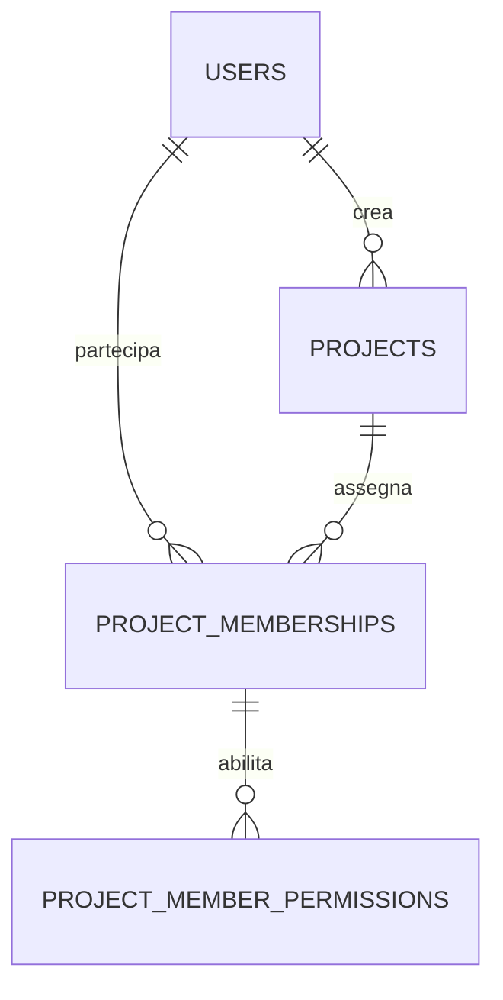

# Progetto e collaboratori

## Stato dell'implementazione

Implementata la base dati: `projects` e `project_memberships`, model e relazioni con User, enum PHP per tipo/stato/accesso, factory e `ProjectSeeder` dimostrativo. Le migration conservano i valori enum espliciti come snapshot dello schema. Sono adottati i tipi e gli stati proposti sotto, con default `inactive` e `viewer`.

Implementata l'API dei progetti con policy, validazione, risorse JSON e test di policy e HTTP. La tabella `project_member_permissions` e il relativo catalogo di codici restano alla fase dei moduli operativi. Le API di gestione dei collaboratori restano un passo successivo; le membership esistenti vengono già considerate per l'accesso in lettura.

Il creatore non è modificabile tramite salvataggi Eloquent e non può essere aggiunto come collaboratore. Le scritture dirette tramite query builder o eventi disabilitati non eseguono questi controlli applicativi: i futuri flussi di scrittura dovranno usare i model e transazioni autorizzate. La FK impedisce la cancellazione del creatore e la policy utenti esistente nega anche la richiesta API.

Da `backend`, applicare le migration con `php artisan migrate`. Il seeder opzionale si esegue con `php artisan db:seed --class=ProjectSeeder`: richiede l'admin già creato corrispondente ad `ADMIN_EMAIL` e funziona soltanto in `local`/`testing`. Crea quattro progetti demo inattivi, senza nuovi account o collaboratori, e non è incluso in `DatabaseSeeder`. Riconosce i demo tramite creatore e nome: ripetendolo preserva i dati esistenti; rinominare un demo permette al seeder di ricreare quello con il nome originale.

Riferimenti: [README](../../README.md), [documento architetturale](../../README-CLAUDE.md), [autenticazione esistente](../authentication.md).

## Obiettivo e requisiti confermati

Ogni progetto ha un unico creatore che ne mantiene la proprietà e la gestione completa. Il creatore può assegnare utenti già presenti nella piattaforma, revocarne l'accesso e stabilire quali operazioni possono eseguire. I collaboratori possono consultare documenti o partecipare alle attività, ma non amministrare gli ambienti.

Il perimetro attuale comprende soltanto dati principali del progetto, proprietà, collaboratori e regole di accesso. Ambienti, settings operativi, IP/DNS, scope e profili di scansione sono rimandati alla bozza separata [environment-and-scanning.md](environment-and-scanning.md). Non sono prerequisiti per creare un progetto.

Tipi, stati e livelli di accesso sono già adottati dalla base dati. Le proposte per i permessi dei moduli futuri richiedono ancora revisione.

## API progetti — `/api/v1/projects`

Tutti gli endpoint richiedono autenticazione Sanctum e applicano il rate limiter API esistente. Ogni account autenticato può creare progetti; il creatore è sempre l'utente autenticato. Il campo `user_id` nel payload viene rifiutato, anche se nullo. I campi non previsti non vengono salvati.

| Metodo e percorso | Comportamento |
| --- | --- |
| `GET /projects` | Elenco dei soli progetti propri o con membership corrente, inclusi inattivi e archiviati; paginazione di 15 elementi, ordinamento per nome e ID |
| `POST /projects` | Creazione con `name` e `type` obbligatori, `description` opzionale; stato iniziale `inactive` oppure `active`, default `inactive`; risposta 201 |
| `GET /projects/{project}` | Dettaglio accessibile al proprietario e ai collaboratori, in qualsiasi stato |
| `PATCH` o `PUT /projects/{project}` | Aggiornamento dei soli campi forniti, riservato al proprietario; risposta 200 |
| `DELETE /projects/{project}` | Archiviazione riservata al proprietario; conserva progetto e membership, risponde 204 anche se già archiviato |

`name` accetta fino a 255 caratteri; `description` è testo nullable con massimo 10000 caratteri. Nome duplicato consentito. La risposta espone soltanto `id`, `user_id`, `name`, `description`, `type`, `status`, `created_at` e `updated_at`, con `Cache-Control: no-store, private`.

Un progetto archiviato rifiuta gli aggiornamenti con 409, eccetto una richiesta contenente il solo campo validato `status` impostato a `inactive` o `active`. Per modificarne anche i dati occorre prima riattivarlo con una richiesta separata. Lo stato viene riletto con lock nella transazione di aggiornamento o archiviazione. Nei progetti non archiviati il proprietario può impostare qualsiasi stato previsto.

Un utente estraneo, compreso un admin globale, riceve 404 su dettaglio, aggiornamento e archiviazione. Un collaboratore riceve 403 sulle scritture. Gli input non validi producono 422. Lettura e lista verificano la membership corrente, senza conservare l'autorizzazione nella sessione o nel token.

L'archiviazione non consente di cancellare l'account proprietario: per questo MVP non sono previsti trasferimento della proprietà o cancellazione definitiva del progetto.

## Relazioni

`users` esiste già. Le entità descritte in questo documento sono `projects`, `project_memberships` e `project_member_permissions`. Documenti, findings e audit avranno modelli dedicati successivamente.

## Project — `projects`

| Campo                      | Significato e vincoli                                           |
| -------------------------- | --------------------------------------------------------------- |
| `id`                       | Identificatore secondo la convenzione già usata nel backend     |
| `user_id`                  | FK obbligatoria verso `users.id`: creatore e proprietario unico |
| `name`                     | Obbligatorio, massimo 255 caratteri; non necessariamente unico  |
| `description`              | Testo facoltativo                                               |
| `type`                     | Enum applicativo `ProjectType`, proposta sotto                  |
| `status`                   | Enum applicativo `ProjectStatus`, default `inactive`            |
| `created_at`, `updated_at` | Date UTC, presentate nel fuso orario dell'utente                |

Il proprietario è derivato da `user_id`, non da una membership modificabile. Non è possibile rimuoverlo dal progetto o ridurne i permessi. Per questa prima versione creatore e proprietario coincidono: il trasferimento di proprietà non è previsto.

### Tipo

Proposta per `ProjectType`: `bug_bounty`, `personal`, `company`, `ctf`.

Questi valori descrivono categorie operative utili alla UI, ma mescolano contesto e attività: un bug bounty può anche essere aziendale. Per la prima versione si sceglie una categoria principale, senza effetti sui permessi. Se serviranno filtri indipendenti, separeremo contesto (`personal`, `company`) e attività (`bug_bounty`, `assessment`, `ctf`, `research`) prima di implementare lo schema.

### Stato

| Valore     | Comportamento proposto                                                          |
| ---------- | ------------------------------------------------------------------------------- |
| `inactive` | Progetto non operativo; dati e collaboratori restano gestibili dal proprietario |
| `active`   | Progetto in lavorazione                                                         |
| `archived` | Sola lettura; il proprietario può riattivare il progetto                        |

L'archiviazione sostituisce la cancellazione nel primo MVP. Il cambio di stato è riservato al proprietario. In archivio sono consentite soltanto lettura, riattivazione e revoca degli accessi da parte del proprietario. Gli effetti sulle future esecuzioni sono descritti nel documento dedicato.

## Collaboratori — `project_memberships`

| Campo                      | Significato e vincoli               |
| -------------------------- | ----------------------------------- |
| `id`                       | Identificatore della membership     |
| `project_id`               | FK obbligatoria verso `projects.id` |
| `user_id`                  | FK obbligatoria verso `users.id`    |
| `access_level`             | `viewer` oppure `contributor`       |
| `created_at`, `updated_at` | Date di assegnazione e modifica     |

Vincolo unico `(project_id, user_id)`. Il proprietario non viene duplicato in questa tabella. La rimozione della membership revoca l'accesso; il futuro modulo audit dovrà conservarne lo storico. Il creatore assegna solo account esistenti: gli inviti via email sono un flusso successivo.

`viewer` può consultare il progetto e i documenti. `contributor` può ricevere ulteriori permessi granulari. Il livello contributor, da solo, non autorizza scansioni o modifiche.

### Permessi — `project_member_permissions`

| Campo                      | Significato e vincoli                |
| -------------------------- | ------------------------------------ |
| `id`                       | Identificatore                       |
| `project_membership_id`    | FK obbligatoria verso la membership  |
| `permission`               | Codice da un enum applicativo chiuso |
| `created_at`, `updated_at` | Date dell'assegnazione               |

Vincolo unico `(project_membership_id, permission)`. L'assenza di un permesso implica diniego; non sono previsti wildcard, JSON libero o regole di deny sovrapposte. Solo il proprietario assegna permessi e solo ai contributor. Il passaggio a viewer elimina i permessi aggiuntivi nella stessa transazione.

| Operazione                          | Proprietario | Viewer | Contributor |
| ----------------------------------- | ------------ | ------ | ----------- |
| Leggere il progetto                 | Sì           | Sì     | Sì          |
| Modificare nome, descrizione e tipo | Sì           | No     | No          |
| Cambiare stato e archiviare         | Sì           | No     | No          |
| Gestire membri e permessi           | Sì           | No     | No          |

Il creatore conserva il controllo completo. La partecipazione come contributor non consente di modificare i dati principali o amministrare il progetto. La consultazione dei documenti resta un requisito per entrambi i livelli, da applicare quando verrà introdotto il relativo modulo.

La struttura dei permessi è predisposta per le operazioni future, ma in questa fase non introduce permessi di scansione, gestione documenti o findings. Il catalogo dei codici verrà definito con ciascun modulo: fino ad allora viewer e contributor hanno le stesse capacità sul solo Project. Resta fermo il vincolo che i collaboratori non amministrano gli ambienti.

I permessi di progetto sono distinti dai ruoli globali Spatie `admin` e `user`. Un admin globale gestisce gli account ma non ottiene automaticamente accesso a tutti i progetti. Un eventuale accesso amministrativo eccezionale andrà definito esplicitamente.

## Integrità e autorizzazione

- La proprietà viene assegnata dall'utente autenticato alla creazione e non accettata liberamente dal payload.
- Il proprietario non può essere inserito come collaboratore: controllo applicativo transazionale perché coinvolge due tabelle.
- Le membership e i relativi permessi sono sempre caricati nel contesto del progetto autorizzato; conoscere un ID non concede accesso.
- L'eliminazione di un proprietario viene bloccata finché possiede progetti, anche archiviati. La gestione utenti esistente applica già questo controllo.
- Eliminare un collaboratore rimuove membership e permessi. Revocare una membership rimuove i suoi permessi nella stessa operazione.
- Le autorizzazioni sono verificate dal backend a ogni richiesta. Una revoca deve impedire anche le successive richieste da sessioni già aperte.
- La registrazione delle modifiche a proprietà, membri e permessi sarà trattata nel futuro modello di audit, senza introdurne qui lo schema.
- Indici iniziali: `projects(user_id, status)`, `project_memberships(user_id, project_id)` e vincoli unici già indicati.
- Nome e descrizione sono testo, non HTML eseguibile. Le API restituiscono soltanto campi autorizzati.

## Prima implementazione dopo revisione

1. Modello Project, enum, migrazione e relazione con il creatore.
2. Membership e struttura dei permessi, con vincoli e policy.
3. CRUD, assegnazione/revoca dei collaboratori e test di isolamento fra progetti.
4. Collegamento del frontend per elenco, dettaglio e gestione progetto.

Ambienti, settings operativi, scope, profili, esecuzioni, documenti e findings verranno affrontati separatamente. Lo stato della prima implementazione è riportato all'inizio del documento.

## Scelte da confermare in revisione

1. Tipi: categoria unica `bug_bounty | personal | company | ctf`, oppure separazione contesto/attività?
2. Stati: default inattivo, attivo e archiviato con le regole indicate?
3. Accessi: proprietario unico, viewer e contributor con permessi aggiuntivi definiti nei futuri moduli?
4. Admin globale: nessun accesso automatico ai progetti altrui?

Per la prima base dati sono stati adottati i tipi, gli stati e i livelli di accesso indicati; le regole applicative rimanenti guideranno la fase API e policy.
