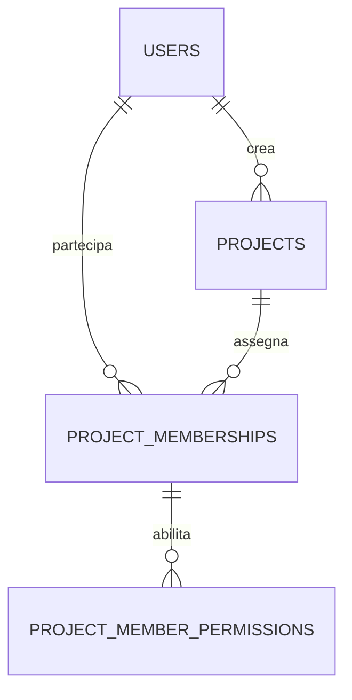

# Progetto e collaboratori

Riferimenti: [README](../../README.md), [documento architetturale](../../README-CLAUDE.md), [autenticazione esistente](../authentication.md).

## Obiettivo e requisiti confermati

Ogni progetto ha un unico creatore che ne mantiene la proprietà e la gestione completa. Il creatore può assegnare utenti già presenti nella piattaforma, revocarne l'accesso e stabilire quali operazioni possono eseguire. I collaboratori possono consultare documenti o partecipare alle attività, ma non amministrare gli ambienti.

Il perimetro attuale comprende soltanto dati principali del progetto, proprietà, collaboratori e regole di accesso. Ambienti, settings operativi, IP/DNS, scope e profili di scansione sono rimandati alla bozza separata [environment-and-scanning.md](environment-and-scanning.md). Non sono prerequisiti per creare un progetto.

Le scelte indicate come proposta, compresi enum e permessi, richiedono revisione prima delle migration.

## Relazioni

`users` esiste già. Le entità descritte in questo documento sono `projects`, `project_memberships` e `project_member_permissions`. Documenti, findings e audit avranno modelli dedicati successivamente.

## Project — `projects`

| Campo                      | Significato e vincoli                                           |
| -------------------------- | --------------------------------------------------------------- |
| `id`                       | Identificatore secondo la convenzione già usata nel backend     |
| `user_id`                  | FK obbligatoria verso `users.id`: creatore e proprietario unico |
| `name`                     | Obbligatorio, massimo 255 caratteri; non necessariamente unico  |
| `description`              | Testo facoltativo                                               |
| `type`                     | Enum applicativo `ProjectType`, proposta sotto                  |
| `status`                   | Enum applicativo `ProjectStatus`, default `inactive`            |
| `created_at`, `updated_at` | Date UTC, presentate nel fuso orario dell'utente                |

Il proprietario è derivato da `user_id`, non da una membership modificabile. Non è possibile rimuoverlo dal progetto o ridurne i permessi. Per questa prima versione creatore e proprietario coincidono: il trasferimento di proprietà non è previsto.

### Tipo

Proposta per `ProjectType`: `bug_bounty`, `personal`, `company`, `ctf`.

Questi valori descrivono categorie operative utili alla UI, ma mescolano contesto e attività: un bug bounty può anche essere aziendale. Per la prima versione si sceglie una categoria principale, senza effetti sui permessi. Se serviranno filtri indipendenti, separeremo contesto (`personal`, `company`) e attività (`bug_bounty`, `assessment`, `ctf`, `research`) prima di implementare lo schema.

### Stato

| Valore     | Comportamento proposto                                                          |
| ---------- | ------------------------------------------------------------------------------- |
| `inactive` | Progetto non operativo; dati e collaboratori restano gestibili dal proprietario |
| `active`   | Progetto in lavorazione                                                         |
| `archived` | Sola lettura; il proprietario può riattivare il progetto                        |

L'archiviazione sostituisce la cancellazione nel primo MVP. Il cambio di stato è riservato al proprietario. In archivio sono consentite soltanto lettura, riattivazione e revoca degli accessi da parte del proprietario. Gli effetti sulle future esecuzioni sono descritti nel documento dedicato.

## Collaboratori — `project_memberships`

| Campo                      | Significato e vincoli               |
| -------------------------- | ----------------------------------- |
| `id`                       | Identificatore della membership     |
| `project_id`               | FK obbligatoria verso `projects.id` |
| `user_id`                  | FK obbligatoria verso `users.id`    |
| `access_level`             | `viewer` oppure `contributor`       |
| `created_at`, `updated_at` | Date di assegnazione e modifica     |

Vincolo unico `(project_id, user_id)`. Il proprietario non viene duplicato in questa tabella. La rimozione della membership revoca l'accesso; il futuro modulo audit dovrà conservarne lo storico. Il creatore assegna solo account esistenti: gli inviti via email sono un flusso successivo.

`viewer` può consultare il progetto e i documenti. `contributor` può ricevere ulteriori permessi granulari. Il livello contributor, da solo, non autorizza scansioni o modifiche.

### Permessi — `project_member_permissions`

| Campo                      | Significato e vincoli                |
| -------------------------- | ------------------------------------ |
| `id`                       | Identificatore                       |
| `project_membership_id`    | FK obbligatoria verso la membership  |
| `permission`               | Codice da un enum applicativo chiuso |
| `created_at`, `updated_at` | Date dell'assegnazione               |

Vincolo unico `(project_membership_id, permission)`. L'assenza di un permesso implica diniego; non sono previsti wildcard, JSON libero o regole di deny sovrapposte. Solo il proprietario assegna permessi e solo ai contributor. Il passaggio a viewer elimina i permessi aggiuntivi nella stessa transazione.

| Operazione                          | Proprietario | Viewer | Contributor |
| ----------------------------------- | ------------ | ------ | ----------- |
| Leggere il progetto                 | Sì           | Sì     | Sì          |
| Modificare nome, descrizione e tipo | Sì           | No     | No          |
| Cambiare stato e archiviare         | Sì           | No     | No          |
| Gestire membri e permessi           | Sì           | No     | No          |

Il creatore conserva il controllo completo. La partecipazione come contributor non consente di modificare i dati principali o amministrare il progetto. La consultazione dei documenti resta un requisito per entrambi i livelli, da applicare quando verrà introdotto il relativo modulo.

La struttura dei permessi è predisposta per le operazioni future, ma in questa fase non introduce permessi di scansione, gestione documenti o findings. Il catalogo dei codici verrà definito con ciascun modulo: fino ad allora viewer e contributor hanno le stesse capacità sul solo Project. Resta fermo il vincolo che i collaboratori non amministrano gli ambienti.

I permessi di progetto sono distinti dai ruoli globali Spatie `admin` e `user`. Proposta: un admin globale gestisce gli account ma non ottiene automaticamente accesso a tutti i progetti. Un eventuale accesso amministrativo eccezionale andrà definito esplicitamente.

## Integrità e autorizzazione

- La proprietà viene assegnata dall'utente autenticato alla creazione e non accettata liberamente dal payload.
- Il proprietario non può essere inserito come collaboratore: controllo applicativo transazionale perché coinvolge due tabelle.
- Le membership e i relativi permessi sono sempre caricati nel contesto del progetto autorizzato; conoscere un ID non concede accesso.
- L'eliminazione di un proprietario viene bloccata finché possiede progetti. Questo richiederà un aggiornamento della gestione utenti esistente.
- Eliminare un collaboratore rimuove membership e permessi. Revocare una membership rimuove i suoi permessi nella stessa operazione.
- Le autorizzazioni sono verificate dal backend a ogni richiesta. Una revoca deve impedire anche le successive richieste da sessioni già aperte.
- La registrazione delle modifiche a proprietà, membri e permessi sarà trattata nel futuro modello di audit, senza introdurne qui lo schema.
- Indici iniziali: `projects(user_id, status)`, `project_memberships(user_id, project_id)` e vincoli unici già indicati.
- Nome e descrizione sono testo, non HTML eseguibile. Le API restituiscono soltanto campi autorizzati.

## Prima implementazione dopo revisione

1. Modello Project, enum, migrazione e relazione con il creatore.
2. Membership e struttura dei permessi, con vincoli e policy.
3. CRUD, assegnazione/revoca dei collaboratori e test di isolamento fra progetti.
4. Collegamento del frontend per elenco, dettaglio e gestione progetto.

Ambienti, settings operativi, scope, profili, esecuzioni, documenti e findings verranno affrontati separatamente. Nessuna migration viene creata durante questa revisione documentale.

## Scelte da confermare in revisione

1. Tipi: categoria unica `bug_bounty | personal | company | ctf`, oppure separazione contesto/attività?
2. Stati: default inattivo, attivo e archiviato con le regole indicate?
3. Accessi: proprietario unico, viewer e contributor con permessi aggiuntivi definiti nei futuri moduli?
4. Admin globale: nessun accesso automatico ai progetti altrui?

Solo dopo la revisione questa proposta diventerà il riferimento per le migration.
